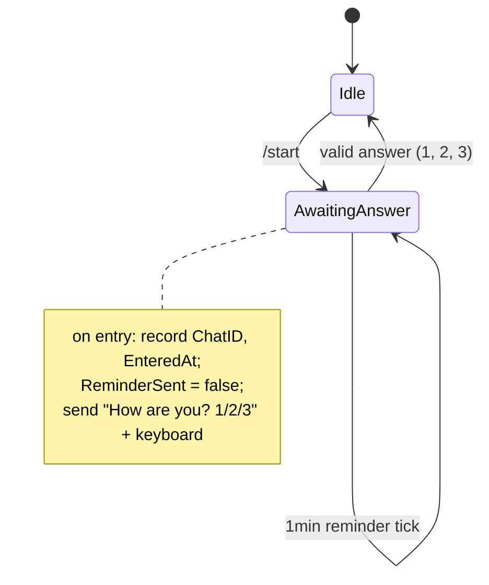
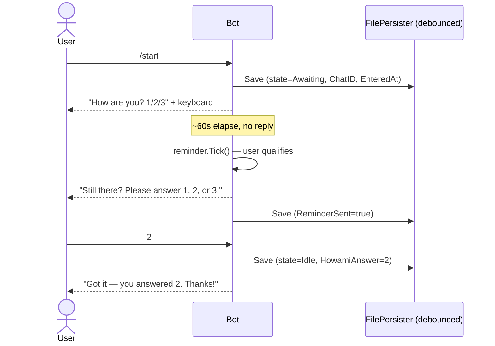

# tgbase

A Go-based Telegram bot platform. Receives updates via long polling.

## Commands

| Command    | Response                                                       |
|------------|----------------------------------------------------------------|
| `/ping`    | `pong`                                                         |
| `/whoami`  | env label, hostname, OS/arch of the instance                   |
| `/menu`    | reply keyboard with `[Ping]` `[Whoami]` shortcuts              |
| `/start`   | begins the "How are you? 1/2/3" survey flow (see below)        |

## Flow

### Survey state machine



### Sequence — /start with reminder path



## Prerequisites

- [Go 1.23+](https://go.dev/dl/) (for local development)
- [Docker](https://docs.docker.com/get-docker/) (for VPS deployment)
- A Telegram bot token from [@BotFather](https://t.me/BotFather)

## Local development

```bash
# 1. Clone and enter the repo
git clone https://github.com/padington/tgbase.git
cd tgbase

# 2. Install dependencies
go mod tidy

# 3. Set your token
cp .env.example .env
# edit .env — fill in TELEGRAM_BOT_TOKEN and BOT_ENV=local

# 4. Run
export $(cat .env | xargs)
go run ./cmd/bot
```

## CI/CD — GitHub Actions + self-hosted runner

Every push to `main` triggers `.github/workflows/deploy.yml`, which runs on a **self-hosted runner** installed on the VPS. The workflow:

1. Checks out the latest code
2. Builds a fresh Docker image on the VPS
3. Stops and removes the old container
4. Starts a new container with the updated image

```
push to main
    └─► GitHub Actions (deploy.yml)
            └─► self-hosted runner on VPS
                    ├─ docker build -t tgbase .
                    ├─ docker stop tgbot
                    └─ docker run tgbase
```

You can also trigger a deploy manually from the Actions tab or via CLI:

```bash
gh workflow run deploy.yml --repo padington/tgbase
```

### GitHub repository secrets

Configure these at `Settings → Secrets and variables → Actions`:

| Secret               | Description                    |
|----------------------|--------------------------------|
| `TELEGRAM_BOT_TOKEN` | Token from @BotFather          |

### Self-hosted runner setup (one-time, on the VPS)

1. Go to `Settings → Actions → Runners → New self-hosted runner`
2. Follow the GitHub instructions to download and configure the runner
3. Start the runner — it registers itself with the repo
4. Make sure the runner user is in the `docker` group:
   ```bash
   sudo usermod -aG docker $USER
   ```
5. Restart the runner so the group change takes effect

## Docker (manual)

```bash
# Build
docker build -t tgbase .

# Run
docker run -d \
  --name tgbot \
  --restart unless-stopped \
  -e TELEGRAM_BOT_TOKEN=your_token_here \
  -e BOT_ENV=vps \
  tgbase

# Logs
docker logs -f tgbot
```

## Environment variables

| Variable             | Required | Default   | Description                           |
|----------------------|----------|-----------|---------------------------------------|
| `TELEGRAM_BOT_TOKEN` | yes      | —         | Token from @BotFather                 |
| `BOT_DEBUG`          | no       | `false`   | Log every Telegram API call           |
| `BOT_ENV`            | no       | `unknown` | Label shown in `/whoami` (e.g. `vps`) |

## Project layout

```
cmd/bot/                   — entry point
internal/bot/
  bot.go                   — Bot struct, long-poll loop
  handlers.go              — command handlers (/ping, /whoami)
.github/workflows/
  deploy.yml               — CI/CD deploy workflow
Dockerfile                 — multi-stage production image
.env.example               — environment variable template
scripts/setup.sh           — one-time VPS setup helper
```
