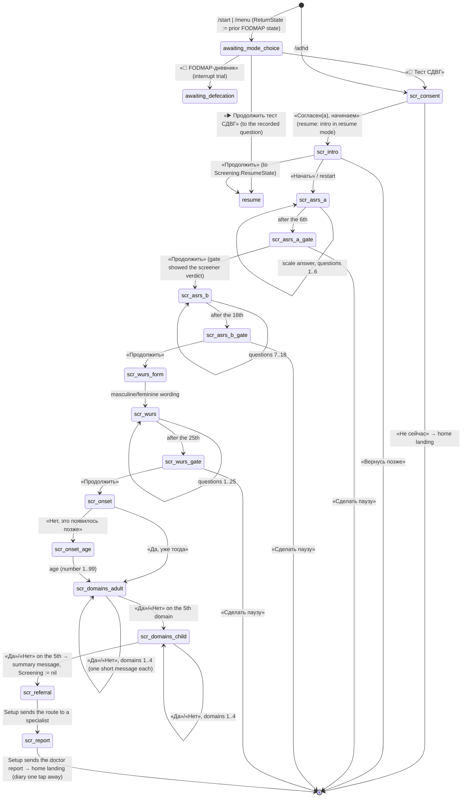
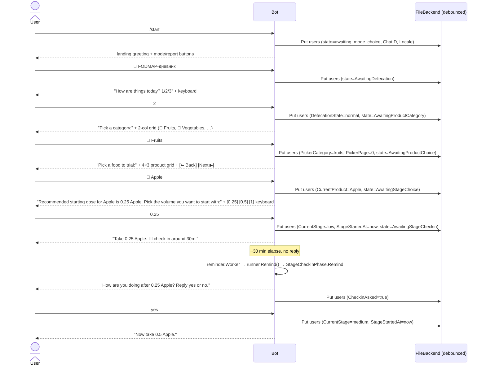

# tgbase

A Telegram bot with four modes:

- **Low-FODMAP diary** — helps people on the **low-FODMAP diet** systematically reintroduce high-FODMAP foods, one at a time, in three escalating volumes (low → medium → high). Tracks per-user progress, nudges users who go quiet, and produces a report on demand.
- **Adult ADHD self-check** (ru-only, v1) — a staged screening: ASRS v1.1 part A (official Russian WHO text, verbatim) → ASRS part B → WURS-25 childhood retrospective → the bot's own DSM-5-shaped context questions (onset + five life domains, one short yes/no question per domain per life phase). Each instrument is scored separately with its own published threshold; there is deliberately **no combined score**. The result is a wording («pattern is / is not consistent with DSM-5 criteria»), a short screening-not-a-diagnosis disclaimer, a two-line route to a specialist, a shareable doctor report, and one compact attribution line (ASRS © WHO/Kessler; WURS-25 — Ward et al.; DSM-5-based context) in the result footer. User texts stay lean by owner decision: methodology notes (translation status, validation caveats) live in content-file comments and docs, never in messages.
- **Mood module** (ru-only, v2) — three instruments behind one consent and one mini-menu: the **WHO-5** well-being quick check (official Russian text from WHO publication WHO-UCN-MSD-MHE-2024.01, verbatim; 5 statements, raw sum × 4 → 0–100), the **PHQ-9** depression screening (official Russian version from phqscreeners.com, verbatim; free to use — Pfizer removed all restrictions) now including the form's official functional (10th) question — asked only when at least one answer is positive, never counted into the 0–27 score, surfaced in the doctor report — and the **GAD-7** anxiety screening (official Russian version, same free PHQ family; 0–21 with the published 0–4/5–9/10–14/15–21 gradations). Each instrument yields its own result with its own score and band wording — **no combined index**. The links: a reduced WHO-5 (≤ 50) offers the PHQ-9 with one button (insistently below ≤ 28); the PHQ-9 report offers the GAD-7 («настроение и тревога часто идут вместе» — no clinical terms). The **combined doctor report** lists everything completed with dates. **Deterministic crisis protocol in code** (PHQ-9 only — WHO-5/GAD-7 carry no crisis items): any answer > 0 on item 9 (thoughts of death / self-harm) shows a warm support-contacts card immediately after the answer — the test is not blocked (Continue proceeds), an answer of 2–3 adds one direct talk-to-someone-today line, and the contacts repeat in the final result regardless of the total score. The children's helpline is deliberately excluded, pinned by tests.
- **Eating track** (ru-only, v1) — three instruments behind one consent and one mini-menu, aimed at one outcome: a summary worth taking to a doctor. The **EDE-QS** core test (12 items about the last 7 days, official form from the PLoS ONE 2016 paper's S2 File, CC BY 4.0; two answer scales as on paper — days for items 1–10, severity for 11–12; sum 0–36 against the Prnjak et al. 2020 screening cutoff ≥ 15), the **BES** overeating scale (16 groups of weighted statements from the NIMH Data Archive dictionary; the group is a numbered list in the message and the keyboard carries the numbers; sum 0–46 with the customary ≤ 17 / 18–26 / ≥ 27 gradations), and the **NIAS** picky-eating screen (9 statements, three independent subscales of 0–15 — избирательность / аппетит / опасения — with the Burton Murray et al. 2021 cutoffs ≥ 10 / ≥ 9 / ≥ 10, and **no total by design**: the instrument is read per subscale). The one cross-instrument rule is Burton Murray's, deterministic and in code (`screening.NiasContext`): a positive NIAS subscale reads as restriction *without* body-image concern when the EDE-QS came out below its cutoff, as restriction *likely tied to* body image when it came out at or above, and stays explicitly undecidable while the EDE-QS has not been taken — so the reading upgrades itself the moment the core test is done. The **combined doctor report** lists everything completed with dates, scores and the applied cutoffs, and auto-appends a low-FODMAP line whenever the user has diary activity, so a clinician reading the restraint items knows part of the restriction is medically prescribed. Russian translations are the bot authors' own (no validated Russian versions exist) and their provenance is pinned in the content files. **No instrument in this track asks for a weight, height or calorie figure, and no result names a diagnosis** — a deliberate property of the chosen instruments and of every user-facing string, enforced by canonical tests in `internal/screening` and a canary over the assembled chat surface in `internal/journey`.

## Commands

| Command        | Response                                                                  |
|----------------|---------------------------------------------------------------------------|
| `/start`       | Home landing: short greeting + mode buttons (FODMAP diary / ADHD test / mood / food) + 📊 report + contextual resume buttons (unfinished test, active trial). Works from ANY state as a universal escape — progress is never lost |
| `/adhd`        | Enter / resume the ADHD self-check (consent first, progress survives pauses) |
| `/adhd_delete` | Delete all stored ADHD self-check data (with confirmation)                |
| `/mood`        | Enter the mood module — one-time consent, then the mini-menu: «⚡ Быстрый чек (1 мин)» (WHO-5) / «📋 Настроение (PHQ-9)» / «😰 Тревога (GAD-7)» + resume rows for unfinished runs. Named `/mood`, not `/depression`: it matches the mode's user-facing name and keeps a diagnosis word out of the command menu; `/mood_delete` pairs with `/adhd_delete` |
| `/mood_delete` | Delete all stored mood-module data — all three instruments plus the consent (with confirmation) |
| `/food`        | Enter the eating track — one-time consent, then the mini-menu: «📋 Основной тест» (EDE-QS) / «🍩 Переедание» (BES) / «🥄 Избирательность в еде» (NIAS) + resume rows for unfinished runs. Named `/food`, not after any instrument or condition: the command menu must not carry a diagnosis word, and «отношения с едой» is what the mode is called to the user |
| `/food_delete` | Delete all stored eating-track data — all three instruments plus the consent (with confirmation) |
| `/about`       | Short bot description (localized)                                         |
| `/report`      | Per-user breakdown: completed / in-progress / not tolerated / interrupted, plus one lean summary line per completed self-check instrument |
| `/abandon`     | Mid-self-check (any track): wipes the unfinished run only — the other instruments and every completed result stay. Otherwise: marks the current trial as interrupted |
| `/ping`        | `pong` — health check                                                     |
| `/whoami`      | env label, hostname, OS/arch                                              |
| `/menu`        | alias of `/start` — the same home landing                                 |

On boot the bot self-registers the client command menu via the Bot API
(`setMyCommands`): `menu`, `adhd`, `mood`, `food`, `report`, `about`,
`abandon`, `adhd_delete`, `mood_delete`, `food_delete` in usage-frequency
order, with ru descriptions as the default and an English
`language_code="en"` variant, both taken from the i18n bundles. No manual
BotFather step is needed — the menu always matches the deployed binary, and
a track that is not wired contributes neither of its commands (`/start` is
omitted because Telegram shows its own Start button; `/ping` and `/whoami`
are operator commands and stay out of the menu).
Registration failure is a logged warning, never a boot error.

## Architecture

```
internal/store      generic key-value Backend (FileBackend, MemoryBackend, DebouncedBackend)
internal/state      per-user UserData on top of store.Backend (key="users")
internal/products   FODMAP catalog with metadata, mutable at runtime (key="products")
internal/settings   reminder/check-in tunables, mutable at runtime (key="settings")
internal/i18n       per-locale UI strings loaded from i18n/<locale>.yaml
internal/screening  read-only self-check content (ASRS/WURS/DSM + PHQ-9/WHO-5/GAD-7 mood + EDE-QS/BES/NIAS eating bundles) + pure scoring
internal/journey    Phase-based interaction framework + concrete phases of every mode
internal/reminder   scan loop that delegates per-user nudges to journey.Runner
internal/router     Telegram update dispatcher
internal/bot        composition root: wires backend → typed stores → runner
proto/              canonical schemas (state, products, settings, i18n)
```

`products.yaml`, `settings.yaml`, and `i18n/*.yaml` are bundled into the Docker image as first-boot seeds. After first boot the backend (under `DATA_DIR`) is the source of truth — admin commands can mutate products and settings at runtime without a redeploy. `screening/*.yaml` is different: like the i18n bundles it is read-only and reloaded on every boot, never copied into the backend — instrument texts and thresholds change only via redeploy.

## Flow

### State machine — home landing + FODMAP diary

`/start`, `/menu` and the 🏠 button (present on every FODMAP keyboard) escape
to the landing from ANY state without losing progress: a FODMAP journey
state is recorded to `ReturnState`, a resumable test position to the run's
`ResumeState` (eating runs record nothing — every `eat_*` question phase
derives its position from the answers). The landing is contextual — an
unfinished ADHD/mood/eating run adds a «▶️ Продолжить …» button (back to the
exact question, or the crisis card), an active trial adds «▶️ Вернуться к
дневнику: <product> (<stage>)»; «📊
Отчёт» renders the /report breakdown in place. Every test exit (result
screens, pause, decline, `/abandon`, mid-test delete) also lands here —
never straight into a mid-diary question: the recorded diary position stays
one tap away via «▶️ Вернуться к дневнику». Reminder nudges never reach a
user parked on the landing.

```mermaid
stateDiagram-v2
    [*] --> Idle
    Idle --> awaiting_mode_choice : /start | /menu | 🏠 (from ANY state; FODMAP position → ReturnState)
    awaiting_mode_choice --> AwaitingDefecation : «🥦 FODMAP-дневник» (interrupts the active trial — legacy /start)
    awaiting_mode_choice --> scr_consent : «🧠 Тест СДВГ» (diary progress untouched)
    awaiting_mode_choice --> mood_menu : «🌤 Настроение» (consent first for fresh users; diary progress untouched)
    awaiting_mode_choice --> eat_menu : «🍽 Отношения с едой» (consent first for fresh users; diary progress untouched)
    awaiting_mode_choice --> awaiting_mode_choice : «📊 Отчёт» (stays on the landing)
    awaiting_mode_choice --> AwaitingStageCheckin : «▶️ Вернуться к дневнику» (ReturnState consumed, nothing interrupted)
    awaiting_mode_choice --> resume_test : «▶️ Продолжить тест …» (same question / crisis card)
    AwaitingDefecation --> AwaitingProductCategory : 1/2/3 → fluid/normal/issues
    AwaitingProductCategory --> AwaitingProductChoice : tap category (auto-skips when only one bucket has products)
    AwaitingProductCategory --> Idle : catalog exhausted (auto report)
    AwaitingProductChoice --> AwaitingProductChoice : tap Prev / Next (page)
    AwaitingProductChoice --> AwaitingProductCategory : tap Back (or category emptied)
    AwaitingProductChoice --> AwaitingStageChoice : pick product
    AwaitingStageChoice --> AwaitingStageCheckin : pick volume (low/medium/high)
    AwaitingStageCheckin --> AwaitingStageCheckin : "yes" → advance to next stage
    AwaitingStageCheckin --> AwaitingProductChoice : "yes" on high → completed
    AwaitingStageCheckin --> AwaitingProductChoice : "no" → not_tolerated
    AwaitingDefecation --> AwaitingDefecation : reminder tick
    AwaitingStageCheckin --> AwaitingStageCheckin : reminder tick (auto-prompts "are you OK?")
```



### State machine — ADHD self-check

Exits marked `[*]` land on the home landing (`awaiting_mode_choice`); the
FODMAP detour recorded in `ReturnState` is kept, and the landing offers it
via «▶️ Вернуться к дневнику». `scr_*` states get no reminder nudges. `/abandon`,
`/start` and `/menu` work at any point (the escape records the position in
`Screening.ResumeState` — resumable states only, never the consent/intro
gates or the delete confirmation). The landing's «▶️ Продолжить тест СДВГ»
button jumps straight back to the recorded question; resume mode itself is
detected by the actual presence of answers, so a lost `ResumeState` never
turns «Начать» into a silent progress wipe (the position is then derived
from the answers).



Each life-domain step is one short message — position («Сфера N из 5 ·
зрелость/детство»), domain title, one «Например: …» line, and a yes/no
keyboard. The answered-domain cursor lives in `Screening` (like the
ASRS/WURS question index), so pause, `/start` and `/adhd` mid-section
resume on the exact domain; only «Да» domains are stored, and the ≥2-domains
rule of the overall verdict is unchanged.

Deleting data: `/adhd_delete` → `scr_delete_confirm` → «Да, удалить» wipes
both the unfinished progress and the stored result; «Оставить» changes
nothing — and mid-test it returns straight to the interrupted question
(`/adhd_delete` records the position in `Screening.ResumeState` on entry),
so the confirmation can never strand the user or lose the resume position.
Closing the dialog otherwise returns to what the command interrupted (the
FODMAP question or the landing); a mid-test «Да, удалить» abandons the run
and therefore lands on the home landing.
Privacy: raw per-question answers exist only while a run is
unfinished and are erased in the same write that stores the final
`ScreeningResult` (scores + applied thresholds + facts only); the doctor
report is rendered on the fly and never stored.

### State machine — Mood module (WHO-5 / PHQ-9 / GAD-7)

Exits marked `[*]` land on the home landing (`awaiting_mode_choice`); the
FODMAP detour recorded in `ReturnState` is kept, and the landing offers it
via «▶️ Вернуться к дневнику». `mood_*` states get no reminder nudges.
Consent is asked ONCE for the whole module (`MoodConsentAt`; any stored
mood data implies it, so v1 users are never re-asked) and opens the
mini-menu: the three instrument buttons plus contextual «▶️ Продолжить…»
rows for unfinished runs (an instrument button is the explicit start-over
when its own run is paused). `/abandon`, `/start` and `/menu` work at any
point — the escape records a PHQ-9 position in `Mood.ResumeState`
(`mood_question` / `mood_crisis` / `mood_q10`; a run paused on the crisis
card or the functional question resumes there), while WHO-5/GAD-7 positions
derive from the answer count. The landing's «▶️ Продолжить тест настроения»
button jumps straight into the single unfinished run, or to the menu when
several are paused. `/mood_delete` mid-test records the position too, and
«Оставить» returns straight to the interrupted question / card.

```mermaid
stateDiagram-v2
    [*] --> awaiting_mode_choice: /start | /menu (ReturnState := prior FODMAP state)
    awaiting_mode_choice --> mood_consent: «🌤 Настроение» (fresh user)
    awaiting_mode_choice --> mood_menu: «🌤 Настроение» (consent already given)
    awaiting_mode_choice --> resume: «▶️ Продолжить тест настроения» (single run → its position)
    [*] --> mood_consent: /mood (fresh user; else straight to the menu)
    mood_consent --> mood_menu: «Понятно, дальше» (MoodConsentAt := now — once per module)
    mood_consent --> [*]: «Не сейчас» → home landing
    mood_menu --> mood_who5_question: «⚡ Быстрый чек (1 мин)»
    mood_menu --> mood_question: «📋 Настроение (PHQ-9)»
    mood_menu --> mood_gad7_question: «😰 Тревога (GAD-7)»
    mood_menu --> resume2: «▶️ Продолжить…» rows (per unfinished instrument)
    mood_who5_question --> mood_who5_question: scale answer, statements 1..4
    mood_who5_question --> [*]: 5th answer, score > 50 → result «в норме», Who5 := nil
    mood_who5_question --> mood_offer_phq9: 5th answer, score ≤ 50 → result + offer (insistent ≤ 28)
    mood_offer_phq9 --> mood_question: «📋 Пройти тест настроения» (resumes a paused run)
    mood_offer_phq9 --> [*]: «Не сейчас»
    mood_question --> mood_question: scale answer, questions 1..8
    mood_question --> mood_crisis: answer > 0 on question 9 → crisis card IMMEDIATELY
    mood_question --> mood_q10: 9 answers, any > 0 → the official functional question
    mood_question --> mood_report: all 9 answers = 0 → result, Mood := nil
    mood_crisis --> mood_q10: «Продолжить» (q9 > 0 always opens the q10 gate)
    mood_q10 --> mood_report: option tapped → result (q10 stored outside the 0–27 score), Mood := nil
    mood_report --> mood_offer_gad7: combined doctor report → GAD-7 offer (after a PHQ-9 completion)
    mood_offer_gad7 --> mood_gad7_question: «😰 Пройти тест тревоги» (resumes a paused run)
    mood_offer_gad7 --> [*]: «Не сейчас»
    mood_gad7_question --> mood_gad7_question: scale answer, questions 1..6
    mood_gad7_question --> mood_report: 7th answer → result, Gad7 := nil
    mood_report --> [*]: after a GAD-7 completion → home landing (diary one tap away)
```



Crisis protocol (all deterministic, in code, unit-tested per branch): the
card = warm lead + support contacts (экстренная психологическая помощь МЧС
+7 495 989-50-50 — круглосуточно, вся Россия; Москва 051 / +7 495 051;
Красный Крест 8-800-250-18-59, 07:00–22:00 мск; 112 при угрозе жизни;
findahelpline.com for users outside Russia). An answer of 2–3 on item 9 adds one direct
talk-to-someone-today line. Any answer > 0 also repeats the contacts block
inside the final result, whatever the total score. The card never blocks
the test. The children's helpline 8-800-2000-122 must never appear —
refused by the content validator and pinned by canonical tests.

Results & retest: each instrument renders its own result — PHQ-9 0–27
with the published bands (0–4 / 5–9 / 10–14 / 15–19 / 20–27) and, on a
repeat run, the delta against the previous stored result plus the
repeat-in-2–4-weeks line; WHO-5 0–100 with > 50 «в норме» / ≤ 50 «снижено»
/ ≤ 28 «выраженное снижение»; GAD-7 0–21 with 0–4 / 5–9 / 10–14 / 15–21 —
all wordings without diagnosis labels, each with one compact attribution
line (PHQ-9, GAD-7 — Spitzer, Williams, Kroenke; WHO-5 — © ВОЗ). The
combined doctor report lists everything completed with dates, the item-9
fact and the functional (10th) answer. Deleting data: `/mood_delete` →
`mood_delete_confirm`, same semantics as `/adhd_delete` — confirm wipes all
three instruments' runs and results plus the module consent. Privacy: raw
answers exist only while a run is unfinished and are erased in the same
write that stores the final result (totals + band ids + dates + the two
allowed PHQ-9 facts); the doctor report is rendered on the fly and never
stored.

### State machine — Eating track (EDE-QS / BES / NIAS)

Exits marked `[*]` land on the home landing (`awaiting_mode_choice`); the
FODMAP detour recorded in `ReturnState` is kept, and the landing offers it
via «▶️ Вернуться к дневнику». `eat_*` states get no reminder nudges.
Consent is asked ONCE for the whole track (`EatConsentAt`; any stored eating
data implies it) and opens the mini-menu: the three instrument buttons plus
contextual «▶️ Продолжить…» rows for unfinished runs — an instrument button
with its own run paused is the explicit start-over, and the resume row sits
directly above it.

The track is deliberately flatter than the mood module: **no offer chain and
no crisis card**. Every instrument ends the same way — score, reading,
combined doctor report, landing.

Pauses need no bookkeeping here. All three question phases derive the
current item from `len(Answers)`, so `/start`, `/menu` and 🏠 can interrupt
anywhere and the landing's «▶️ Продолжить тест о еде» resumes on the exact
next question (or opens the menu when several runs are paused). The only
thing ever written to an `EatingProgress.ResumeState` is `/food_delete`'s
"the dialog was opened mid-test" marker, and the dialog consumes it on
cancel — otherwise a stale marker would make a later `/food_delete` opened
from the landing close back INTO a merely paused run.

```mermaid
stateDiagram-v2
    [*] --> awaiting_mode_choice: /start | /menu | 🏠 (ReturnState := prior FODMAP state)
    awaiting_mode_choice --> eat_consent: «🍽 Отношения с едой» (fresh user)
    awaiting_mode_choice --> eat_menu: «🍽 Отношения с едой» (consent already given)
    awaiting_mode_choice --> resume: «▶️ Продолжить тест о еде» (single paused run → its next question)
    [*] --> eat_consent: /food (fresh user; else straight to the menu)
    eat_consent --> eat_menu: «Понятно, дальше» (EatConsentAt := now — once per track)
    eat_consent --> [*]: «Не сейчас» → home landing (nothing recorded)
    eat_menu --> eat_edeqs_question: «📋 Основной тест» (fresh run — wipes a paused one)
    eat_menu --> eat_bes_question: «🍩 Переедание» (fresh run)
    eat_menu --> eat_nias_question: «🥄 Избирательность в еде» (fresh run)
    eat_menu --> resume2: «▶️ Продолжить…» rows (per unfinished instrument)
    eat_edeqs_question --> eat_edeqs_question: scale answer, items 1..11 (the scale switches days → severity at item 11)
    eat_edeqs_question --> eat_report: 12th answer → result (0–36 vs cutoff ≥ 15), EdeqsResult stored, Edeqs := nil
    eat_bes_question --> eat_bes_question: pick a numbered statement, groups 1..15
    eat_bes_question --> eat_report: 16th answer → result (0–46, band ≤ 17 / 18–26 / ≥ 27), BesResult stored, Bes := nil
    eat_nias_question --> eat_nias_question: scale answer, statements 1..8
    eat_nias_question --> eat_report: 9th answer → result per subscale (no total) + Burton Murray reading vs EdeqsResult, Nias := nil
    eat_report --> [*]: Setup sends the combined doctor report → home landing (diary one tap away)
```



Each EDE-QS message is one item: the «Вопрос N из 12» line and the question
text, with the block heading and the days framing shown once at the start
and the severity framing announced exactly where the paper form switches
(item 11). BES groups carry 3–4 statements far too long for buttons, so the
message renders them as a numbered list and the keyboard carries the numbers
— the stored answer is the picked statement's original **weight** (several
statements in a group can share one, which is why the maximum is 46, not
48). NIAS statements use the 6-option Likert scale of the original.

Results: EDE-QS renders the 0–36 score with the cutoff that was applied and
one of two readings; BES the 0–46 score and its band; NIAS one line per
subscale (score, its own cutoff, verdict) and — only when some subscale is
positive — the Burton Murray reading line, which says outright that the
distinction cannot be made until the core test is taken. Each result carries
the same short screening-is-not-a-diagnosis footer and one compact
attribution line (EDE-QS — Gideon et al.; BES — Gormally et al.; NIAS —
Zickgraf & Ellis).

Deleting data: `/food_delete` → `eat_delete_confirm` → «Да, удалить» wipes
all three runs, all three results and the track consent in one write (the
next entry asks for consent again); «Оставить» changes nothing and returns
straight to the interrupted question, or to whatever the command interrupted
(the FODMAP question or the landing). Confirming mid-test destroys the
position a cancel would return to, so that lands on the home landing.
Privacy: raw per-question answers exist only while a run is unfinished and
are erased in the same write that stores the final result (scores + the
applied cutoffs + dates); the doctor report is rendered on the fly and never
stored.

### Sequence — happy path with reminder



## Prerequisites

- [Go 1.23+](https://go.dev/dl/) (for local development)
- [Docker](https://docs.docker.com/get-docker/) (for VPS deployment)
- A Telegram bot token from [@BotFather](https://t.me/BotFather)

## Local development

```bash
# 1. Clone and enter the repo
git clone https://github.com/padington/tgbase.git
cd tgbase

# 2. Install dependencies
go mod tidy

# 3. Set your token
cp .env.example .env
# edit .env — fill in TELEGRAM_BOT_TOKEN and BOT_ENV=local

# 4. Run
export $(cat .env | xargs)
go run ./cmd/bot
```

## CI/CD — GitHub Actions + self-hosted runner

Every push to `main` triggers `.github/workflows/deploy.yml`, which runs on a **self-hosted runner** installed on the VPS. The workflow:

1. Checks out the latest code
2. Builds a fresh Docker image on the VPS
3. Stops and removes the old container
4. Starts a new container with the updated image

```
push to main
    └─► GitHub Actions (deploy.yml)
            └─► self-hosted runner on VPS
                    ├─ docker build -t tgbase .
                    ├─ docker stop tgbot
                    └─ docker run tgbase
```

You can also trigger a deploy manually from the Actions tab or via CLI:

```bash
gh workflow run deploy.yml --repo padington/tgbase
```

### GitHub repository secrets

Configure these at `Settings → Secrets and variables → Actions`:

| Secret               | Description                    |
|----------------------|--------------------------------|
| `TELEGRAM_BOT_TOKEN` | Token from @BotFather          |

### Self-hosted runner setup (one-time, on the VPS)

1. Go to `Settings → Actions → Runners → New self-hosted runner`
2. Follow the GitHub instructions to download and configure the runner
3. Start the runner — it registers itself with the repo
4. Make sure the runner user is in the `docker` group:
   ```bash
   sudo usermod -aG docker $USER
   ```
5. Restart the runner so the group change takes effect

## Docker (manual)

```bash
# Build
docker build -t tgbase .

# Run
docker run -d \
  --name tgbot \
  --restart unless-stopped \
  -e TELEGRAM_BOT_TOKEN=your_token_here \
  -e BOT_ENV=vps \
  tgbase

# Logs
docker logs -f tgbot
```

## Environment variables

| Variable             | Required | Default            | Description                                                |
|----------------------|----------|--------------------|------------------------------------------------------------|
| `TELEGRAM_BOT_TOKEN` | yes      | —                  | Token from @BotFather                                      |
| `BOT_DEBUG`          | no       | `false`            | Log every Telegram API call                                |
| `BOT_ENV`            | no       | `unknown`          | Label shown in `/whoami` (e.g. `vps`)                      |
| `DATA_DIR`           | no       | derived/in-memory  | Directory for backend JSON files. Empty → in-memory backend|
| `CONFIG_PATH`        | no       | `/config.yaml`     | Boot-time config path (state flush interval, seed paths)   |

## Runtime mutation

Both `products` and `settings` live in the backend, not in the Docker image. After first boot:

- Edit `$DATA_DIR/products.json` (or use a future admin command) → next time `/start` shows the list, the changes appear.
- Edit `$DATA_DIR/settings.json` → reminder timing and default locale change without restart (intervals are sampled every tick).

Bundled `products.yaml` / `settings.yaml` / `i18n/*.yaml` only seed the backend on first boot.

## Localization

UI strings live in `i18n/<locale>.yaml` baked into the image (`en.yaml`, `ru.yaml` ship by default). Product names + notes carry inline `name_localized` / `note_localized` maps so they can be translated alongside the catalog. Each user's locale is detected from `msg.From.LanguageCode` on first `/start` and persisted on `UserData.Locale`.

All three self-check tracks are **ru-only in v1**: the official Russian ASRS and PHQ-9 texts are the point of those features, and the eating track ships the bot authors' own Russian translations (no validated Russian versions of EDE-QS/BES/NIAS exist). Their texts live in `screening/*.yaml` (not i18n) and reach users through the `scr.text` pass-through key; en users get the ru texts via the translator's per-key fallback. Only the landing and the command menu are translated.

## Project layout

```
cmd/bot/                  entry point
internal/
  bot/                    composition root
  router/                 Telegram dispatcher
  store/                  Backend interface + File/Memory/Debounced impls
  state/                  per-user data on top of store
  products/               catalog with FODMAP metadata
  settings/               runtime-mutable timings + default locale
  i18n/                   translator (loads i18n/*.yaml)
  screening/              self-check content loaders/validators (ADHD + mood + eating) + pure scoring
  journey/                Phase framework + concrete phases of all modes
  reminder/               scan loop, delegates to journey.Runner.Remind
  flows/meta/             stateless commands (/ping, /whoami)
proto/                    canonical .proto schemas
i18n/                     bundled UI string yamls
screening/                bundled read-only self-check content yamls (ADHD + mood + eating track)
products.yaml             first-boot product catalog seed
settings.yaml             first-boot settings seed
config.yaml               boot-only paths + state flush interval
.github/workflows/        CI (test.yml, deploy.yml)
Dockerfile                multi-stage production image
```
