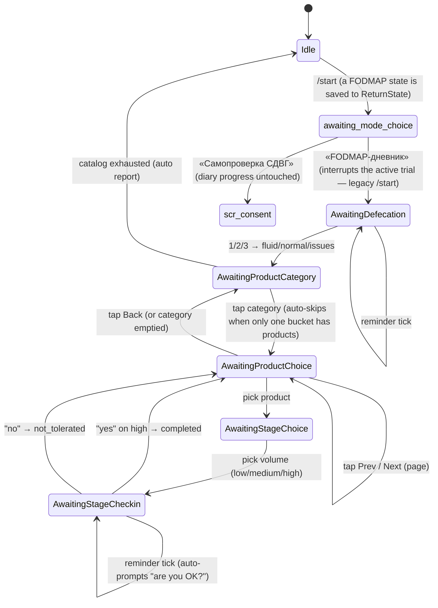
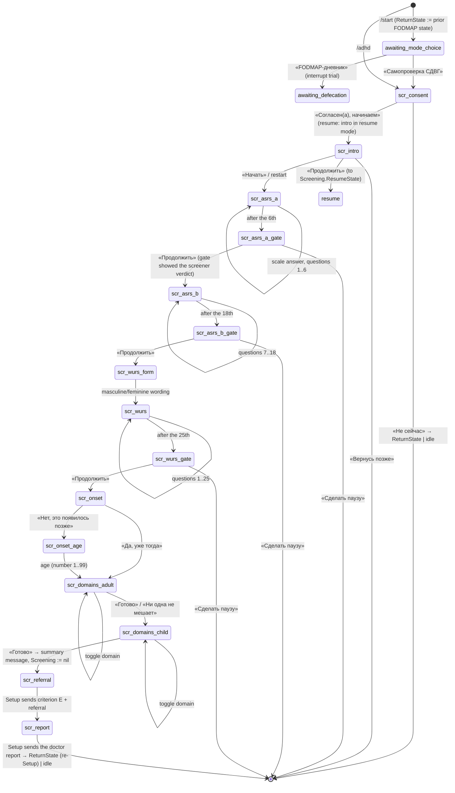
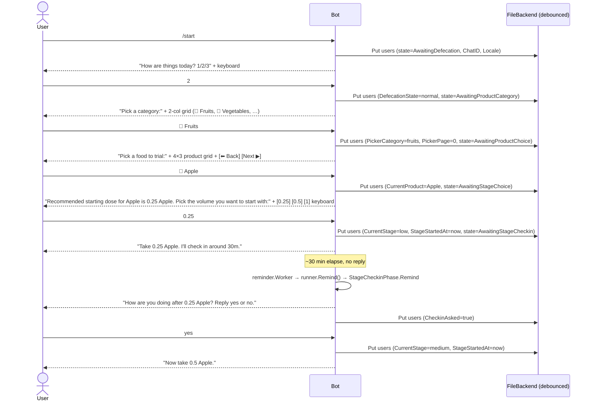

# tgbase

A Telegram bot with two modes:

- **Low-FODMAP diary** — helps people on the **low-FODMAP diet** systematically reintroduce high-FODMAP foods, one at a time, in three escalating volumes (low → medium → high). Tracks per-user progress, nudges users who go quiet, and produces a report on demand.
- **Adult ADHD self-check** (ru-only, v1) — a staged screening: ASRS v1.1 part A (official Russian WHO text, verbatim) → ASRS part B → WURS-25 childhood retrospective (unofficial translation, flagged as such) → the bot's own DSM-5-shaped context questions (onset + life domains). Each instrument is scored separately with its own published threshold and attribution; there is deliberately **no combined score**. The result is a wording («pattern is / is not consistent with DSM-5 criteria»), a screening-not-a-diagnosis disclaimer, a route to a specialist, and a shareable doctor report.

## Commands

| Command        | Response                                                                  |
|----------------|---------------------------------------------------------------------------|
| `/start`       | Mode fork: FODMAP diary (legacy /start semantics) or ADHD self-check      |
| `/adhd`        | Enter / resume the ADHD self-check (consent first, progress survives pauses) |
| `/adhd_delete` | Delete all stored self-check data (with confirmation)                     |
| `/about`       | Short bot description (localized)                                         |
| `/report`      | Per-user breakdown: completed / in-progress / not tolerated / interrupted, plus the last self-check summary line |
| `/abandon`     | Mid-screening: wipes the unfinished run (keeps the last completed result). Otherwise: marks the current trial as interrupted |
| `/ping`        | `pong` — health check                                                     |
| `/whoami`      | env label, hostname, OS/arch                                              |
| `/menu`        | reply keyboard with `[Ping]` `[Whoami]` shortcuts                         |

> Ops note: after deploying, update the BotFather command list
> (`adhd — самопроверка СДВГ`, `adhd_delete — удалить данные самопроверки`).

## Architecture

```
internal/store      generic key-value Backend (FileBackend, MemoryBackend, DebouncedBackend)
internal/state      per-user UserData on top of store.Backend (key="users")
internal/products   FODMAP catalog with metadata, mutable at runtime (key="products")
internal/settings   reminder/check-in tunables, mutable at runtime (key="settings")
internal/i18n       per-locale UI strings loaded from i18n/<locale>.yaml
internal/screening  read-only ADHD screening content (ASRS/WURS/DSM module) + pure scoring
internal/journey    Phase-based interaction framework + concrete phases (both modes)
internal/reminder   scan loop that delegates per-user nudges to journey.Runner
internal/router     Telegram update dispatcher
internal/bot        composition root: wires backend → typed stores → runner
proto/              canonical schemas (state, products, settings, i18n)
```

`products.yaml`, `settings.yaml`, and `i18n/*.yaml` are bundled into the Docker image as first-boot seeds. After first boot the backend (under `DATA_DIR`) is the source of truth — admin commands can mutate products and settings at runtime without a redeploy. `screening/*.yaml` is different: like the i18n bundles it is read-only and reloaded on every boot, never copied into the backend — instrument texts and thresholds change only via redeploy.

## Flow

### State machine — mode fork + FODMAP diary



### State machine — ADHD self-check

Exits marked `[*]` land in `ReturnState` (the recorded FODMAP state, whose
Setup re-fires) or idle. `scr_*` states get no reminder nudges. `/abandon`
and `/start` work at any point (`/start` records the position in
`Screening.ResumeState`).



Deleting data: `/adhd_delete` → `scr_delete_confirm` → «Да, удалить» wipes
both the unfinished progress and the stored result; «Оставить» changes
nothing. Privacy: raw per-question answers exist only while a run is
unfinished and are erased in the same write that stores the final
`ScreeningResult` (scores + applied thresholds + facts only); the doctor
report is rendered on the fly and never stored.

### Sequence — happy path with reminder



## Prerequisites

- [Go 1.23+](https://go.dev/dl/) (for local development)
- [Docker](https://docs.docker.com/get-docker/) (for VPS deployment)
- A Telegram bot token from [@BotFather](https://t.me/BotFather)

## Local development

```bash
# 1. Clone and enter the repo
git clone https://github.com/padington/tgbase.git
cd tgbase

# 2. Install dependencies
go mod tidy

# 3. Set your token
cp .env.example .env
# edit .env — fill in TELEGRAM_BOT_TOKEN and BOT_ENV=local

# 4. Run
export $(cat .env | xargs)
go run ./cmd/bot
```

## CI/CD — GitHub Actions + self-hosted runner

Every push to `main` triggers `.github/workflows/deploy.yml`, which runs on a **self-hosted runner** installed on the VPS. The workflow:

1. Checks out the latest code
2. Builds a fresh Docker image on the VPS
3. Stops and removes the old container
4. Starts a new container with the updated image

```
push to main
    └─► GitHub Actions (deploy.yml)
            └─► self-hosted runner on VPS
                    ├─ docker build -t tgbase .
                    ├─ docker stop tgbot
                    └─ docker run tgbase
```

You can also trigger a deploy manually from the Actions tab or via CLI:

```bash
gh workflow run deploy.yml --repo padington/tgbase
```

### GitHub repository secrets

Configure these at `Settings → Secrets and variables → Actions`:

| Secret               | Description                    |
|----------------------|--------------------------------|
| `TELEGRAM_BOT_TOKEN` | Token from @BotFather          |

### Self-hosted runner setup (one-time, on the VPS)

1. Go to `Settings → Actions → Runners → New self-hosted runner`
2. Follow the GitHub instructions to download and configure the runner
3. Start the runner — it registers itself with the repo
4. Make sure the runner user is in the `docker` group:
   ```bash
   sudo usermod -aG docker $USER
   ```
5. Restart the runner so the group change takes effect

## Docker (manual)

```bash
# Build
docker build -t tgbase .

# Run
docker run -d \
  --name tgbot \
  --restart unless-stopped \
  -e TELEGRAM_BOT_TOKEN=your_token_here \
  -e BOT_ENV=vps \
  tgbase

# Logs
docker logs -f tgbot
```

## Environment variables

| Variable             | Required | Default            | Description                                                |
|----------------------|----------|--------------------|------------------------------------------------------------|
| `TELEGRAM_BOT_TOKEN` | yes      | —                  | Token from @BotFather                                      |
| `BOT_DEBUG`          | no       | `false`            | Log every Telegram API call                                |
| `BOT_ENV`            | no       | `unknown`          | Label shown in `/whoami` (e.g. `vps`)                      |
| `DATA_DIR`           | no       | derived/in-memory  | Directory for backend JSON files. Empty → in-memory backend|
| `CONFIG_PATH`        | no       | `/config.yaml`     | Boot-time config path (state flush interval, seed paths)   |

## Runtime mutation

Both `products` and `settings` live in the backend, not in the Docker image. After first boot:

- Edit `$DATA_DIR/products.json` (or use a future admin command) → next time `/start` shows the list, the changes appear.
- Edit `$DATA_DIR/settings.json` → reminder timing and default locale change without restart (intervals are sampled every tick).

Bundled `products.yaml` / `settings.yaml` / `i18n/*.yaml` only seed the backend on first boot.

## Localization

UI strings live in `i18n/<locale>.yaml` baked into the image (`en.yaml`, `ru.yaml` ship by default). Product names + notes carry inline `name_localized` / `note_localized` maps so they can be translated alongside the catalog. Each user's locale is detected from `msg.From.LanguageCode` on first `/start` and persisted on `UserData.Locale`.

The ADHD self-check is **ru-only in v1**: the official Russian ASRS text is the point of the feature. Its texts live in `screening/*.yaml` (not i18n) and reach users through the `scr.text` pass-through key; en users get the ru texts via the translator's per-key fallback. Only the mode fork is translated.

## Project layout

```
cmd/bot/                  entry point
internal/
  bot/                    composition root
  router/                 Telegram dispatcher
  store/                  Backend interface + File/Memory/Debounced impls
  state/                  per-user data on top of store
  products/               catalog with FODMAP metadata
  settings/               runtime-mutable timings + default locale
  i18n/                   translator (loads i18n/*.yaml)
  screening/              ADHD screening content loader/validator + pure scoring
  journey/                Phase framework + concrete phases of both modes
  reminder/               scan loop, delegates to journey.Runner.Remind
  flows/meta/             stateless commands (/ping, /whoami, /menu)
proto/                    canonical .proto schemas
i18n/                     bundled UI string yamls
screening/                bundled read-only ADHD screening content yamls
products.yaml             first-boot product catalog seed
settings.yaml             first-boot settings seed
config.yaml               boot-only paths + state flush interval
.github/workflows/        CI (test.yml, deploy.yml)
Dockerfile                multi-stage production image
```
